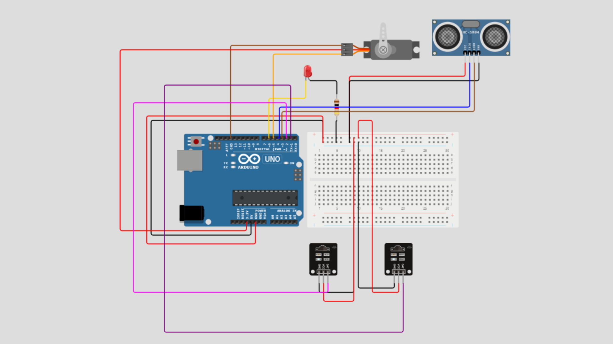

# Smart Parking

This Flutter project aims to create a smart parking application.

## FLOW


## SKEMA



```
Ubah arduino Mengunakan Esp 8266 / Wemos D1

IR SENSOR 1 = D1
IR SENSOR 2 = D2
ECHO = D3
TRIG= D4
SERVO = D5
LED = D6
```

## UI Preview


## Dependencies

To get the latest versions of the dependencies used in this project, run:

```bash
flutter pub outdated
```
